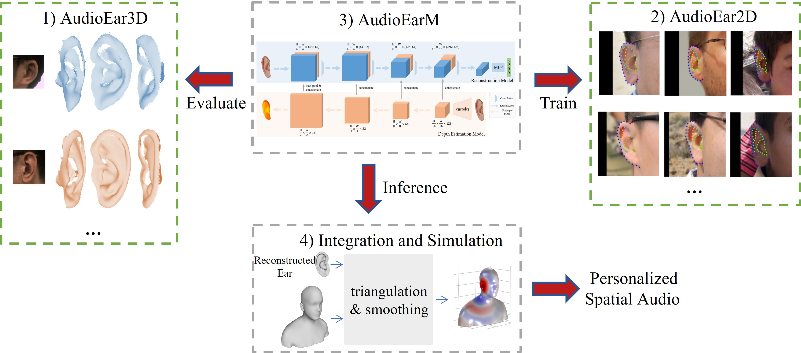
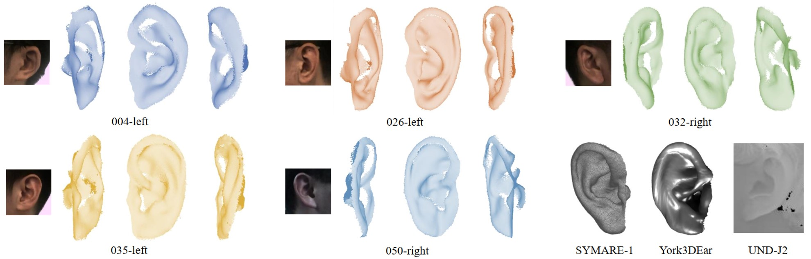
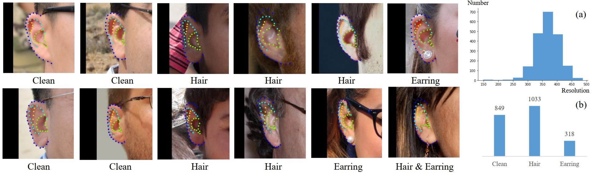

## AudioEar: Single-View Ear Reconstruction for Personalized Spatial Audio

This is the official code of AAAI'23 paper ``AudioEar: Single-View Ear Reconstruction for Personalized Spatial Audio`` written in PyTorch.

**Note**: This codebase is a naive version and is under refactoring. If you have any questions, feel free to contact the <a href="mailto:huangxiaoyang@sjtu.edu.cn">author</a>.

## [Paper](https://arxiv.org/abs/2301.12613)

## Introduction

Spatial audio, which focuses on immersive 3D sound rendering, is widely applied in the acoustic industry. One of t   he key problems of current spatial audio rendering methods is the lack of personalization based on different anatomies of individuals, which is essential to produce accurate sound source positions. In this work, we address this problem from an interdisciplinary perspective. The rendering of spatial audio is strongly correlated with the 3D shape of human bodies, particularly ears. 



To this end, we propose to achieve personalized spatial audio by reconstructing 3D human ears with single-view images. First, to benchmark the ear reconstruction task, we introduce AudioEar3D, a high-quality 3D ear dataset consisting of 112 point cloud ear scans with RGB images. To self-supervisedly train a reconstruction model, we further collect a 2D ear dataset composed of 2,000 images, each one with manual annotation of occlusion and 55 landmarks, named AudioEar2D. To our knowledge, both datasets have the largest scale and best quality of their kinds for public use. Further, we propose AudioEarM, a reconstruction method guided by a depth estimation network that is trained on synthetic data, with two loss functions tailored for ear data. Lastly, to fill the gap between the vision and acoustics community, we develop a pipeline to integrate the reconstructed ear mesh with an off-the-shelf 3D human body and simulate a personalized Head-Related Transfer Function (HRTF), which is the core of spatial audio rendering.

## Published Datasets

Our collected datasets, **AudioEar3D** and **AudioEar2D**, could be downloaded in [Zenodo](https://zenodo.org/record/7592895#.Y9nobHBByNc).  If you find any downloading problem, you could also use this mirror link from [Google Drive](https://drive.google.com/drive/folders/1fWTtaFVkEAgLQRz55h8jQt7eJ6omFjxK?usp=sharing). 


### AudioEar3D



| 3D Ear Dataset  | Scale  | with Image| Quality| Accessibility|
|:----            | :----: |  :----:   | :----: | :----:       |  
|UND-J2           | 1,800  |&#10004;   |\*      |&#10004;      |
|York3DEar        | 500    |&#10008;   |\*      |&#10004;      |
|SYMARE-1         | 20     |&#10008;   |\*\*\*  |&#10004;      |
|SYMARE-2         | 102    |&#10008;   |\*\*\*  |&#10008;      |
|Ploumpis et al.  | 234    |&#10008;   |\*\*\*  |&#10008;      |
|**AudioEar3D**   | 112    |&#10004;   |\*\*\*\*|&#10004;      |


### AudioEar2D



| 2D Ear Dataset | Scale  | Source    |Landmark Annotations| Usage     |
|:----           | :----: |  :----:   | :----:    |:----:     |  
|UND-E           | 464    |Limited   |&#10008;      |Biometrics      |
|AMI             | 700    |Limited   |&#10008;      |Biometrics      |
|IIT Delhi Ear   | 754    |Limited   |&#10008;  |Biometrics      |
|WPUTEDB         | 3348   |Limited   |&#10008;  |Biometrics      |
|UBEAR           | 4,410  |Limited   |&#10008;  |Biometrics      |
|IBug-B          | 2,058  |In-the-wild   |&#10008;  |Biometrics      |
|AWE             | 9,500  |In-the-wild   |&#10008;  |Biometrics      |
|EarVN           | 28,412 |In-the-wild   |&#10008;  |Biometrics      |
|IBug-A          | 605    |In-the-wild   |&#10004;  |Reconstruction     |
|**AudioEar2D**  | 2,000  |In-the-wild   |&#10004;  |Reconstruction      |


## Data Preparation

1. <font color=#A9A9A9>Prepare AudioEar2D Dataset</font>

   - <font color=#A9A9A9>Download AudioEar2D dataset, then modify the ``cfg.model.ear_dataset_path`` in the ``config.py`` to the directory of the dataset.</font>
   - <font color=#A9A9A9>Copy the train/test split file ``split.json file`` in ``./data/AudioEar2D`` to the dataset folder.</font>
   
2. <font color=#A9A9A9>Prepare Texture Model</font>
   
   - <font color=#A9A9A9>Follow the instructions for the [Albedo model](https://github.com/TimoBolkart/BFM_to_FLAME) to get 'FLAME_albedo_from_BFM.npz', then modify the ``cfg.model.tex_path`` in the ``config.py`` to the path of the npz file.</font>
   
3. <font color=#A9A9A9>Prepare AudioEar3D Dataset</font>
   
   - <font color=#A9A9A9>Download AudioEar3D dataset, then modify the ``cfg.s2m.s2m_data_path`` in the ``config.py`` to the directory of the dataset. </font>
   
4. <font color=#A9A9A9>Prepare Synthetic Dataset</font>

   - <font color=#A9A9A9>Download Synthetic dataset from [here](None), then modify the ``cfg.s2m.sythetic_dataset_path`` in the ``config.py`` to the directory of the dataset. </font>


## Requirements


- Python 3.7 

- PyTorch>=1.6

- PyTorch3D>=0.7.0

- CUDA Toolkit>10.2

- Trimesh>=3.9

- numpy>=1.18.5

- scipy>=1.4.1 

- chumpy>=0.69

- scikit-image>=0.15 

- opencv-python>=4.1.1 

- scikit-image>=0.15

- PyYAML>=5.1.1 

  You can install them either manually or through the command:

  ``` bash
  pip install -r requirements.txt
  ```

  Pytorch3D might need manual installation. Follow the [official instruction](https://github.com/facebookresearch/pytorch3d) to install it.


## Usage

1. **Training and validating MDE model on Synthetic dataset**

   ```python
   python train_depth.py
   ```

2. **Training and validating on AudioEar2D dataset**

   Modify the  ``cfg.model.depth_model_path``  to the model obtained from ``train_depth.py``. Then run:

   ```python
   python train_recon.py
   ```

3. **Evaluation on AudioEar3D dataset**

   Change the ``cfg.s2m.recon_model_path `` in the ``config.py`` to the model checkpoint file obtained from ``train_recon.py`` . Then run:

   ```
   python s2mdemo.py
   ```

## Citation

If you find this project useful in your research, please cite the paper as:

```
Xiaoyang Huang, Yanjun Wang, Yang Liu, Bingbing Ni, Wenjun Zhang, Jinxian Liu, Teng Li. "AudioEar: Single-View Ear Reconstruction for Personalized Spatial Audio". arXiv preprint arXiv:2301.12613, 2023.
```

or using bibtex:

``` bibtex
@article{huang2023audioear,
  title={AudioEar: Single-View Ear Reconstruction for Personalized Spatial Audio},
  author={Huang, Xiaoyang and Wang, Yanjun and Liu, Yang and Ni, Bingbing and Zhang Wenjun and Liu Jinxian and Li, Teng},
  journal={arXiv preprint arXiv:2301.12613},
  year={2023}
}
```